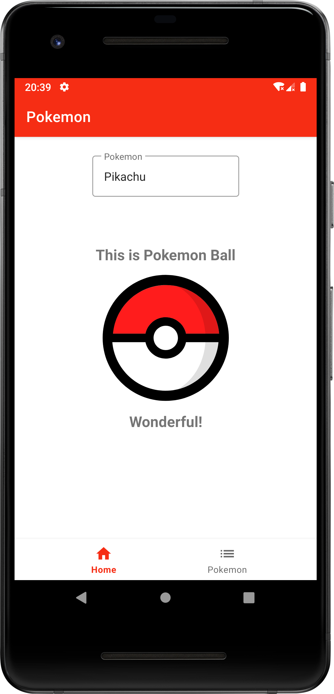
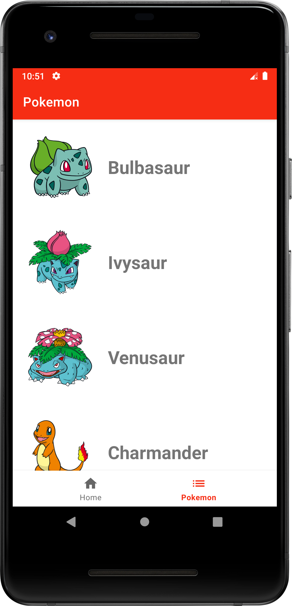

# Pokemon App

## Introduction

In Develhope we developed in collaboration to the students a pokemon app showcase.

We adopted Clean Architecture (Data Layer, Domain Layer and UI Layer) and MVVM pattern following the latest Android guidelines.  
For the Dependency Injection we have chosen koin library.

## Screens

### Home

In the home screen we allowed user to save the favourite pokemon using SharedPreferences.  
Furthermore, you can click the pokemon ball and see what happens.

### Pokemon

In the pokemon screen we show a list of pokemon retrieved using PokeAPI (https://pokeapi.co).  
We managed also the offline status of devices, so the data are saved locally using AndroidX Room when they are downloaded from the server. 

## Collaborators

Here the names of my students that have collaborated with me to develop this application:
- Aurelio di Marco
- Giovanni D'Amico
- Margherita Improda
